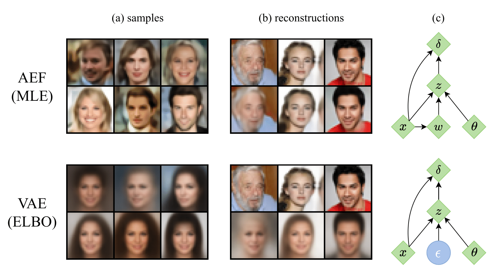

# Closing the gap: Exact maximum likelihood training of generative autoencoders using invertible layers 

This repository contains the official implementation of our paper "[Closing the gap: Exact maximum likelihood training of generative autoencoders using invertible layers]()".

In this work, we provide an exact likelihood alternative to the variational training of generative autoencoders. This is achieved while leaving complete freedom in the choice of encoder, decoder and prior architectures, making our approach a drop-in replacement for the training of existing VAEs and VAE-style models. We show that the approach results in strikingly higher performance than architecturally equivalent VAEs in term of log-likelihood, sample quality and denoising performance. 

## Notebook

In `notebook.ipynb` we give a short tutorial on how to initialize and train an AEF model, and compare samples generated by an AEF to samples generated by a VAE with an equivalent architecture.

## Running experiments

To run experiments we provide a command line interface with the file `main_cli.py`, or `wandb_cli.py` which uses wandb to save experiment details. To train an AEF with a center mask on the MNIST dataset with a latent dimensionality of 2, run: 

    ./main_cli.py --model aef-center --dataset mnist --latent-dims 2 

We provide implementations of baseline models such as vanilla VAEs, VAEs with inverse autoregressive flows, and more. Additional parameters can be specified such as number of training iterations, learning rate, and batch size. For more details, please consult `main_cli.py`.

## Samples

<table width="100%">
  <tr>
  <th>MNIST</th>
  <th>FashionMNIST</th>
  </tr>
  <tr>
  <td width="50%"></td>
  <td width="50%"></td>
  </tr>
  <tr>
  <th>KMNIST</th>
  <th>CelebA-HQ</th>
  </tr>
  <tr>
  <td width="50%"></td>
  <td width="50%"></td>
  </tr>
</table>

## Acknowledgements
This implementation uses parts of the code from the following Github repositories: [nflows](https://github.com/bayesiains/nflows), [rectangular-flows](https://github.com/layer6ai-labs/rectangular-flows), [pytorch-fid](https://github.com/mseitzer/pytorch-fid) as described in our code.